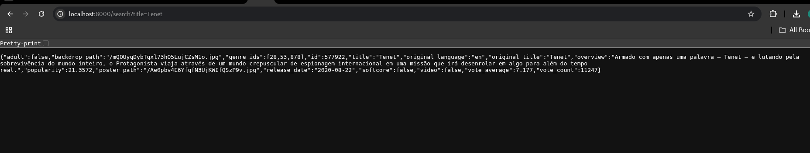
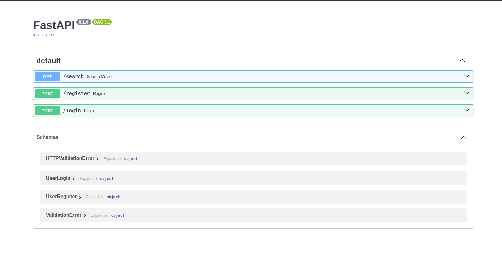

# Execution:

```docker compose up --build```

```docker compose up -d``` runs in the background

```docker compose down```  The PostgreSQL container is removed

```docker compose down -v```  The PostgreSQL volume is also removed


and then in another terminal:

```docker exec -it transcendence_db psql -U bruno -d transcendence```

You can add an film going through this localhost:
http://localhost:8000/search?title=Tenet


You can see all routes in this link: http://localhost:8000/docs#/

## Commands to test:

```\dt```  database

```\l```  list of databases

```SELECT * FROM users;```

```SELECT * FROM reviews;```

```SELECT * FROM media;```

```DELETE FROM media;```  it will delete all of the films
